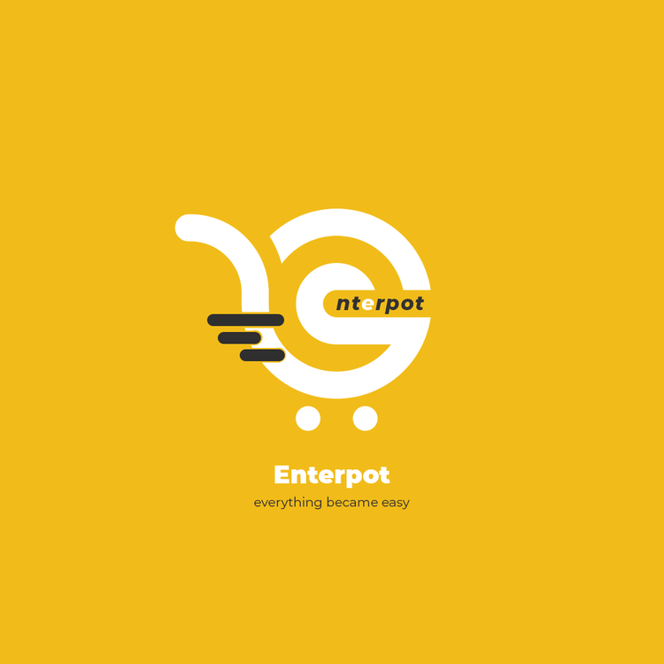
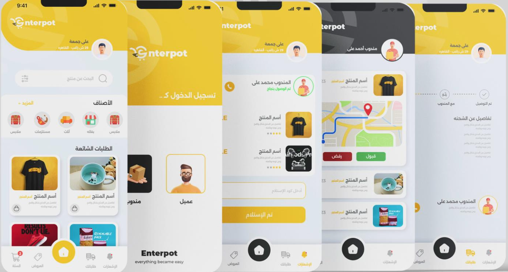
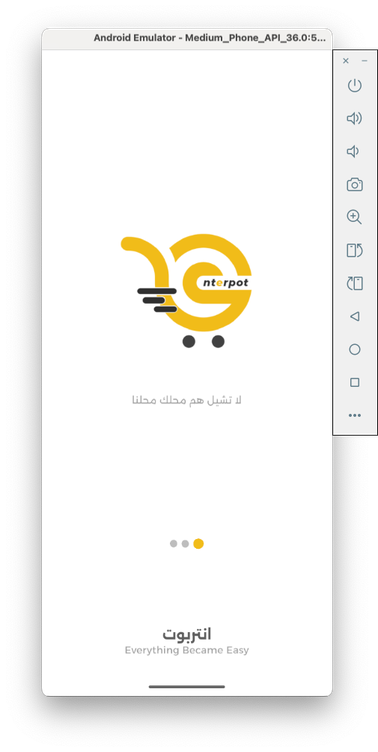
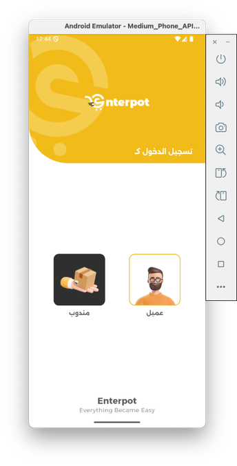
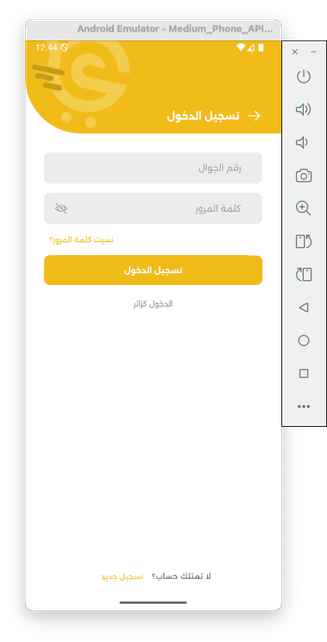
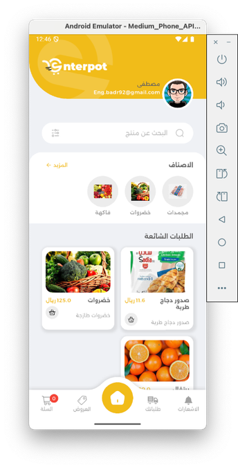
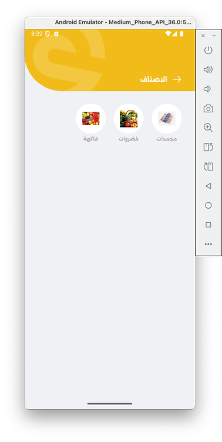
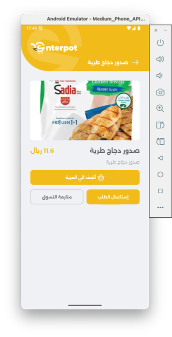
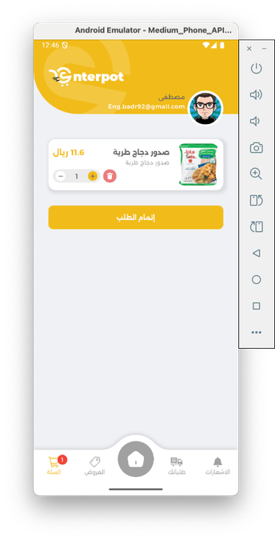
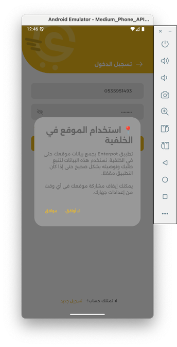

<div align="center">

  

  <p>
    <a href="https://play.google.com/store/apps/details?id=com.newenterpot.app" target="_blank">
      
    </a>
    <a href="https://apps.apple.com/app/id6451003683" target="_blank">
      
    </a>
  </p>

  <h1>Enterpot</h1>

  <p>
    B2B wholesale food products e-commerce platform connecting suppliers with retail traders across Saudi Arabia.
  </p>

  <p>
    
    <a href="https://drive.google.com/file/d/1RCW1TXXOjuq6XVyr-lq9S-q4uxo72rmF/view?usp=sharing" target="_blank"></a>
  </p>

  <p>
    
    
    
    
    
  </p>

</div>

## Overview


Enterpot is a production-ready B2B wholesale food distribution platform serving retail traders across Saudi Arabia. The app enables bulk purchasing, real-time order tracking, dual user experiences (clients and delivery personnel), and seamless payment processing through ClickPay. Built with Flutter and a .NET backend, it delivers enterprise-grade features including Google Maps integration, SQLite-based offline cart management, and comprehensive notification systems.

- **Market**: 🇸🇦 Saudi Arabia (KSA)
- **Business Model**: B2B wholesale e-commerce for food products
- **Users**: Retail traders (clients) and delivery personnel
- **Languages**: Arabic (RTL) & English (LTR)
- **Backend**: .NET RESTful API

<p><strong>نظرة عامة:</strong> منصة تجارة إلكترونية للجملة تربط الموردين بتجار التجزئة في السعودية. التطبيق يدعم الشراء بالجملة، تتبع الطلبات، نظام دفع ClickPay، وخريطة Google Maps للفروع والتوصيل.</p>

## Visual Storyboard

<table>
  <tr>
    <td></td>
  </tr>
</table>

## Technologies

| Layer | Stack |
|---|---|
| Language | Flutter, Dart |
| State Management | GetX (reactive state, dependency injection, routing) |
| Architecture | MVVM with GetX, Repository Pattern |
| Backend | .NET RESTful API, ClickPay payment gateway |
| Networking | HTTP client, Connectivity Plus |
| Local Storage | SQLite (sqflite) for cart, GetStorage for preferences |
| Maps & Location | Google Maps Flutter, Geolocator, real-time tracking (15s updates) |
| Notifications | Firebase Cloud Messaging, Flutter Local Notifications |
| Payments | WebView-based ClickPay integration |
| Localization | Arabic (RTL) & English (LTR), Intl package |
| Analytics | Firebase Analytics |

## Screens & Features

### Client Experience
- **Splash & Onboarding**: Branded splash with kill switch check, 3-screen onboarding
- **Authentication**: Login/Register (phone + password), OTP verification, password reset
- **Home & Discovery**: Product catalog, categories, search, offers, sliders
- **Shopping Cart**: SQLite-based offline cart (products + offers), quantity management
- **Checkout & Payment**: Address selection, time slot, coupon codes, ClickPay WebView payment
- **Order Management**: Order history, details, invoice download, real-time tracking
- **Profile & Settings**: Profile editing, address management (with map picker), language selection

### Delivery Personnel Experience
- **Order Management**: Assigned orders list, order details, status updates
- **Maps Integration**: All orders on map, delivery tracking map, real-time location (15s updates)
- **Delivery Flow**: Navigation to locations, delivery code verification, invoice download
- **Settings**: Delivery-specific settings, profile management

### Shared Features
- **Notifications**: Firebase FCM with deep linking, notification center, smart token management
- **Chat System**: In-app messaging UI (ready for backend integration)
- **Kill Switch**: Remote app control for maintenance/emergencies
- **Multi-Flavor Support**: Environment-specific configurations

## Highlights

- **Dual User Architecture**: Separate experiences for clients and delivery personnel with role-based navigation
- **Offline-First Cart**: SQLite persistence ensures cart survives app restarts and works offline
- **Real-Time Location Tracking**: Background GPS updates every 15 seconds for delivery personnel
- **Advanced Google Maps**: Multiple map implementations (location picker, orders map, delivery tracking)
- **ClickPay Integration**: Secure WebView-based payment processing with backend-managed payment URLs
- **Production-Ready**: Live on Google Play and App Store with enterprise-grade features
- **Full RTL Support**: Complete Arabic localization with right-to-left layouts
- **Kill Switch**: Remote app control mechanism for maintenance and security

## Visual Architecture

```
App (Flutter) — MVVM with GetX
├─ presentation/        # Views, ViewModels (GetX Controllers), Widgets
└─ data/                # Models, Repositories, Network client, SQLite DB

Cross-cutting: routing, theming, localization, notifications, flavor config
```

## Project Structure

```
lib/
├─ common/                      # Shared code
│  ├─ data/
│  │  ├─ model/                # 50+ data models
│  │  ├─ network/              # API client, token management
│  │  └─ repo/                 # 15+ repositories
│  ├─ presentation/
│  │  ├─ view/                 # 30+ screens
│  │  └─ widget/               # Reusable widgets
│  ├─ shared/                  # Utilities, routing, theme, DB helper
│  └─ vm/                      # ViewModels (GetX Controllers)
├─ delivery/                    # Delivery-specific features
└─ flavors/                    # Multi-environment configuration
```

## Screenshots

<table>
  <tr>
    <td></td>
    <td></td>
    <td></td>
    <td></td>
  </tr>
  <tr>
    <td></td>
    <td></td>
    <td></td>
    <td></td>
  </tr>
</table>

## Demos (GIF Previews)

> ⏳ **Heads up:** GIFs may take a moment to load. If playback is slow, open them directly from the repo under `assets/demos/gifs/`.

<p align="center">
  <a href="https://drive.google.com/file/d/1RCW1TXXOjuq6XVyr-lq9S-q4uxo72rmF/view?usp=sharing" target="_blank" style="display: inline-block; margin: 16px;">
    
  </a>
</p>

<p align="center">
  <a href="assets/demos/gifs/demo.gif" target="_blank">
    
  </a>
</p>

## Team & Company

This project was developed by **Direct Choice** ([dco.sa](https://www.dco.sa/)), an IT services establishment specializing in digital platforms for corporations.

### Development Team
- **2 Flutter Developers**: Mobile app development and implementation
- **1 Backend Developer**: .NET RESTful API development and integration
- **1 UI/UX Designer**: User interface design and user experience optimization
- **1 Account Owner**: Project management and client coordination

Direct Choice provides comprehensive IT services including brand identity, web design & development, Microsoft Cloud Solutions (Office 365, Azure), and enterprise software solutions.

<p><strong>الفريق والشركة:</strong> تم تطوير هذا المشروع بواسطة <strong>Direct Choice</strong>، مؤسسة متخصصة في خدمات تكنولوجيا المعلومات والمنصات الرقمية للشركات. الفريق يتكون من مطورين Flutter، مطور Backend، مصمم UI/UX، ومدير حساب.</p>

---

## Contact

- Email: <a href="mailto:eng.ashrf100@gmail.com?subject=Enterpot%20Inquiry">eng.ashrf100@gmail.com</a>
- WhatsApp: <a href="https://wa.me/201287200535" target="_blank">+20 128 720 0535</a>
- Phone: <a href="tel:+201287200535">+20 128 720 0535</a>
- **Company Website**: <a href="https://www.dco.sa/" target="_blank">Direct Choice (DCO)</a>

