<div align="center">

  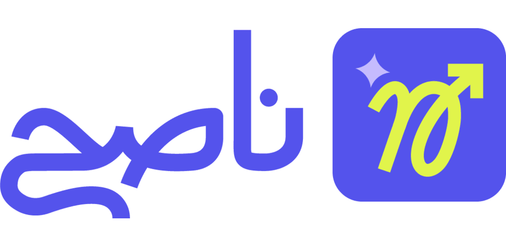

  <h1>Naseh</h1>

  <p>
    Investment channels platform for the Financial Regulatory Authority (FRA) — Egypt. Real-time financial data, investment calculators, and market analytics.
  </p>

  <div align="center">
    <label for="status-slider"><strong>Status:</strong> 90% complete (Phase 1)</label><br/>
    <input id="status-slider" type="range" min="0" max="100" value="90" disabled style="width:260px;">
    <p>Phase 1 near completion · Phase 2 planned (AI integration & payment systems)</p>
  </div>

  <p>
    
    
    
    
    
  </p>

</div>

## Overview

<p align="center">
  <a href="https://drive.google.com/file/d/1UjMTOFUn8cb0AVGkVwpmst4aUFwvuJuM/view?usp=share_link" target="_blank">
    
  </a>
</p>

Naseh is an enterprise-grade investment management platform developed for investment channels in Egypt, operating under the Financial Regulatory Authority (FRA). The app provides real-time financial data, interactive charts, client-side calculators, and comprehensive market analytics. Built with Flutter, it features a sophisticated glassmorphism design system, custom chart implementations, and performance optimizations for handling large financial datasets.

- **Market**: 🇪🇬 Egypt (Financial Regulatory Authority)
- **Users**: Individual investors, financial advisors, banking professionals, investment channel operators
- **Languages**: Arabic (RTL) & English (LTR) with separate theme systems
- **Backend**: PHP Laravel RESTful API

<p><strong>نظرة عامة:</strong> منصة إدارة استثمارات متكاملة لشركات الاستثمار في مصر تحت إشراف الهيئة العامة للرقابة المالية. التطبيق يوفر بيانات مالية مباشرة، رسوم بيانية تفاعلية، حاسبات مالية، وتحليلات سوق شاملة مع تصميم زجاجي متطور.</p>

## Status & Roadmap

- ✅ **Phase 1 (90% complete)**: Core features, metals tracking, currency exchange, investment funds, certificates, custom charts, calculators, authentication, glassmorphism design
- 🚧 **In progress**: Final QA, performance tuning, bug fixes
- 🔜 **Phase 2 (Planned)**: AI integration, payment systems, advanced analytics, social features, portfolio management

<p><strong>الحالة الحالية:</strong> المرحلة الأولى 90% مكتملة (الميزات الأساسية، تتبع المعادن، العملات، صناديق الاستثمار، الشهادات، الرسوم البيانية المخصصة، الحاسبات). المرحلة الثانية: تكامل الذكاء الاصطناعي وأنظمة الدفع.</p>

## Technologies

| Layer | Stack |
|---|---|
| Language | Flutter, Dart |
| State Management | BLoC (complex screens) + Cubit (simple screens), rxdart for debouncing/throttling |
| Architecture | Clean Architecture (simplified: data + presentation layers) |
| Backend | PHP Laravel RESTful API |
| Networking | Dio + Retrofit, Connectivity Plus |
| Error Handling | Dartz (Either pattern), custom failure types |
| Serialization | freezed, json_serializable, build_runner |
| Storage | Flutter Secure Storage (tokens, credentials), SharedPreferences (preferences) |
| UI/UX | Glassmorphism design system, flutter_screenutil, custom chart implementation |
| Animations | Hardware-accelerated animations, spring physics, staggered animations, micro-interactions (140ms), RTL-aware animations, iOS-style transitions, flutter_animate |
| Charts | Custom NasehLineChart (built from scratch), fl_chart extensions |
| Localization | Arabic (RTL) & English (LTR) with separate themes (Montserrat/Cairo fonts) |
| Notifications | Firebase Cloud Messaging, Flutter Local Notifications |
| Dependency Injection | GetIt service locator |
| Performance | Isolates for heavy computation, RepaintBoundary optimization, conditional animations for low-end devices |

## Screens & Features

### Home & Dashboard
- **Home Screen**: Overview dashboard with quick access to all investment categories
- **Real-time Updates**: Live price tickers for metals, currencies, and funds
- **Personalized Content**: User-specific recommendations and quick navigation

### Metals Module
- **Gold Prices**: Real-time prices for 24K, 22K, 21K, 18K, 16K, 14K gold
- **Silver Prices**: Current silver market rates
- **Price Charts**: Interactive historical price charts with custom NasehLineChart
- **Metals Calculator**: Client-side calculation engine for gold/silver values (works offline)
- **Multi-Karat Support**: Calculates prices across all karat levels
- **Manufacturing Cost Estimation**: Includes Egyptian jeweler price formulas

### Currency Module
- **Exchange Rates**: Real-time rates for USD, EUR, GBP, SAR, AED
- **Currency Charts**: Historical exchange rate visualization
- **Currency Converter**: Instant bidirectional conversion (EGP ↔ currencies)
- **Rate Alerts**: Notifications for rate changes

### Investment Funds Module
- **Fund Listings**: Browse all available investment funds with advanced filtering
- **Fund Details**: Comprehensive fund information and performance metrics
- **Performance Charts**: Visual performance tracking with interactive charts
- **Fund Calculator**: Advanced compound interest calculator with daily compounding
- **Projections**: 40-year investment projections with visual charts
- **Search & Filter**: Advanced search capabilities with debouncing

### Certificates Module
- **Certificate Listings**: View all financial certificates
- **Certificate Details**: Detailed certificate information and types
- **Replacement Services**: Certificate replacement workflows
- **Language Switching**: Dynamic language change demonstration

### Search Module
- **Global Search**: Search across all content types (metals, currencies, funds, certificates)
- **Recent Searches**: Quick access to previous searches
- **Filter Options**: Advanced filtering capabilities
- **Search Suggestions**: Intelligent search recommendations
- **Debounced Queries**: Optimized search with RxDart debouncing

### Authentication Module
- **Registration**: User account creation with validation
- **Login**: Secure authentication with email/password
- **OTP Verification**: SMS-based one-time password verification
- **Biometric Authentication**: Face ID, Touch ID, Fingerprint support
- **Profile Management**: User profile editing and account security
- **Secure Token Storage**: Encrypted local storage for tokens

### Notifications Module
- **Notification Center**: View all notifications with history
- **Notification Settings**: Customize notification preferences
- **Firebase FCM**: Background and foreground notification handling
- **Rich Notifications**: Images and custom layouts

### Settings Module
- **Theme Selection**: Light/Dark mode with separate themes for English/Arabic
- **Language Selection**: Dynamic English/Arabic switching with instant theme change
- **App Preferences**: Various app settings and configurations
- **About & Support**: App information and help

## Highlights

- **Custom Chart System**: Built NasehLineChart from scratch using Flutter's canvas API — renders 1000+ data points at 60 FPS with RTL support
- **Glassmorphism Design**: Sophisticated glass card components with multi-layered effects, 100% Figma design fidelity
- **Client-Side Calculators**: Fully offline calculation engines for metals, currency, and investment funds with financial-grade precision
- **Performance Excellence**: Isolate-based heavy computation, RepaintBoundary optimization, 40-60% CPU reduction, <150MB memory footprint
- **Hybrid State Management**: Strategic use of BLoCs (complex screens) and Cubits (simple screens) with RxDart for debouncing/throttling
- **Dual Theme System**: Separate design styles for Arabic (Cairo font) and English (Montserrat font) with complete RTL support
- **Functional Error Handling**: Type-safe error handling with Dartz Either pattern and custom failure types
- **Enterprise Architecture**: Streamlined Clean Architecture (data + presentation) maintaining clean separation without boilerplate

## Technical Excellence Showcase

<table>
<tr>
<td width="50%" valign="top">

### 📊 Custom Chart System

**Built from scratch using Flutter's Canvas API**

#### Implementation Highlights
- **NasehLineChart**: Fully custom line chart widget (no standard libraries)
- **Canvas API**: Direct rendering using `CustomPainter` for pixel-perfect control
- **Isolate-Based Processing**: Heavy computations run in separate threads to prevent UI freezing
- **RepaintBoundary Optimization**: Strategic widget isolation reduces CPU usage by 40-60%
- **Performance**: Renders 1000+ data points at smooth 60 FPS (3x faster than standard libraries)

#### Advanced Features
- **Interactive Touch Points**: Animated tooltips with visual feedback
- **Multi-Timeframe Support**: 1M, 3M, 6M, 1Y, ALL periods with smooth transitions
- **Dynamic Y-Axis Scaling**: Automatically adjusts based on data range
- **RTL Support**: Charts render correctly with reversed X-axis for Arabic
- **Full-Screen Mode**: Enhanced interactions with expanded view
- **Animated Entry Effects**: Smooth data loading animations
- **Memory Efficient**: Only visible data points rendered

#### Technical Achievements
- **Chart Render Time**: <100ms for 1000+ data points
- **Touch Response**: <16ms (1 frame) interaction latency
- **Memory per Chart**: <5MB footprint
- **Smooth Panning/Zooming**: 60 FPS maintained during interactions

</td>
<td width="50%" valign="top">

### 🧮 Client-Side Calculators

**Fully offline calculation engines — zero backend dependency**

#### Metals Calculator
- **24K Gold Fair Price**: Converts international ounce prices to EGP per gram
- **Multi-Karat Support**: 24K, 22K, 21K, 18K, 16K, 14K calculations
- **Silver Price Engine**: Separate calculation system for silver
- **Egyptian Jeweler Formulas**: Implements local market calculation methods
- **Manufacturing Costs**: Calculates total value including manufacturing expenses
- **Real-Time Updates**: Instant recalculation when rates change

#### Currency Converter
- **Multi-Currency**: USD, EUR, GBP, SAR, AED support
- **Bidirectional**: EGP ↔ Currency conversion in both directions
- **Real-Time Rates**: Uses latest exchange rates from API
- **Formatted Display**: Proper decimal formatting and thousand separators

#### Investment Fund Calculator
- **Lump Sum Investment**: One-time investment return calculations
- **Monthly Contributions**: Recurring monthly investment handling
- **Combined Mode**: Initial investment + monthly contributions
- **Daily Compounding**: Industry-standard daily interest calculation
- **40-Year Projections**: Long-term investment forecasting
- **Visual Charts**: Interactive charts display projection data

#### Calculation Accuracy
- **Financial-Grade Precision**: Industry-standard formulas throughout
- **No Rounding Errors**: Proper decimal handling with validated formulas
- **Banking Standards**: Cross-checked with financial institution calculations
- **Instant Results**: All calculations happen client-side with zero latency

</td>
</tr>
</table>

## Visual Architecture

```
App (Flutter) — Clean Architecture (Simplified)
├─ presentation/        # Views, BLoCs/Cubits, Widgets
└─ data/                # Models, Repositories, Network client, Local storage

Cross-cutting: routing, theming (dual themes), localization (AR/EN), error handling, performance optimization
```

## Project Structure

```
lib/
├─ common/                      # Shared code
│  ├─ data/
│  │  ├─ model/                # 50+ data models (Freezed)
│  │  ├─ network/              # API client (Retrofit), token management
│  │  └─ repo/                 # Repositories (Either<Failure, Success>)
│  ├─ presentation/
│  │  ├─ view/                 # 30+ screens
│  │  └─ widget/               # 200+ reusable widgets
│  ├─ shared/                  # Utilities, routing, theme (dual), DB helper
│  └─ bloc/                    # BLoCs (complex) and Cubits (simple)
├─ features/                    # Feature modules
│  ├─ home/
│  ├─ metals/                   # Metals tracking, charts, calculator
│  ├─ currency/                 # Exchange rates, converter, charts
│  ├─ funds/                    # Investment funds, charts, calculator
│  ├─ certificates/             # Financial certificates
│  ├─ search/                   # Global search with debouncing
│  ├─ auth/                     # Authentication, biometric
│  ├─ notifications/            # FCM, notification center
│  └─ settings/                 # Theme, language, preferences
└─ core/                        # Core utilities, constants
```

## Screenshots

<table>
  <tr>
    <td>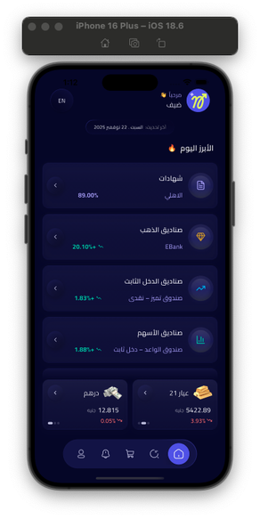</td>
    <td>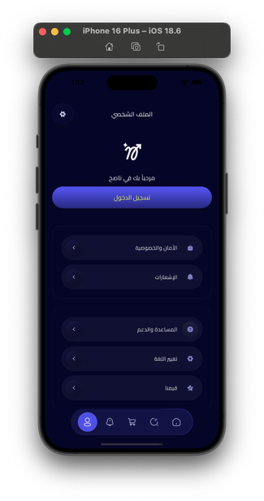</td>
    <td>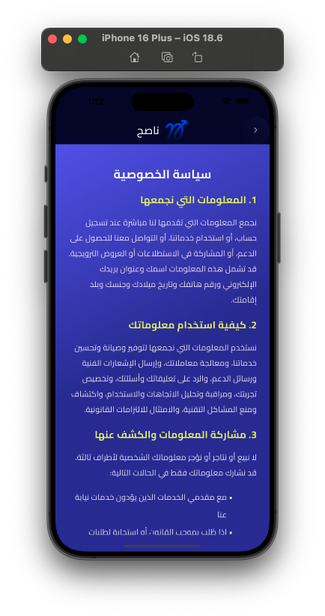</td>
    <td>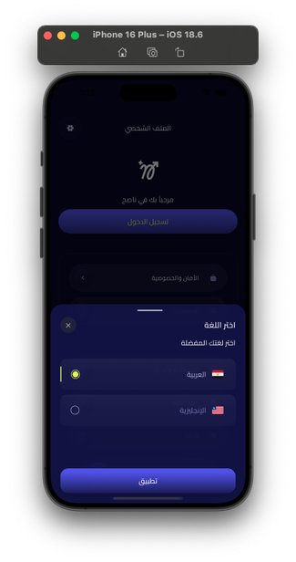</td>
  </tr>
  <tr>
    <td>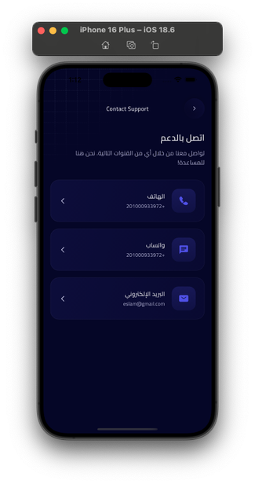</td>
    <td>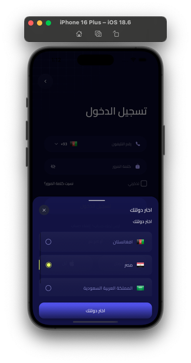</td>
    <td>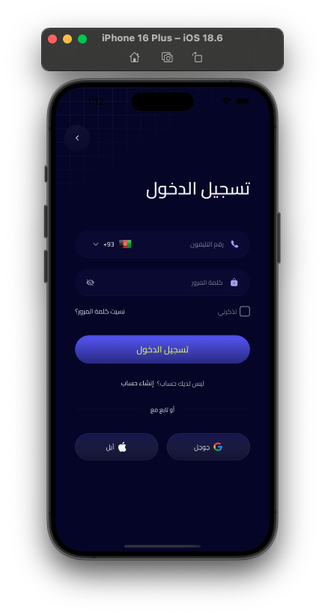</td>
    <td>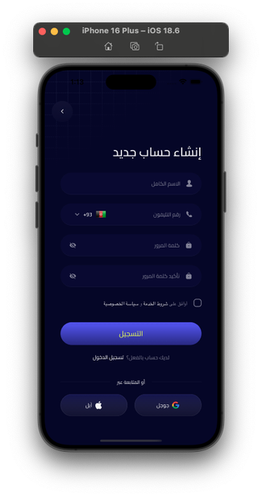</td>
  </tr>
  <tr>
    <td>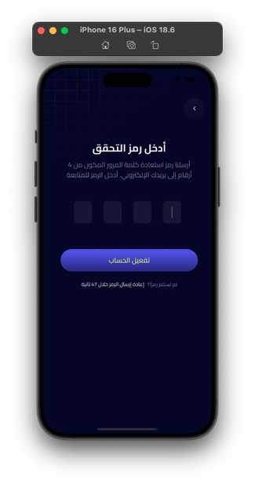</td>
    <td>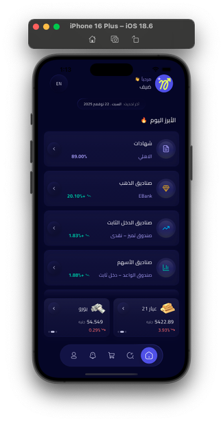</td>
    <td>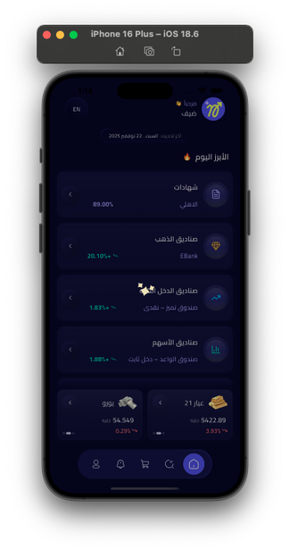</td>
    <td>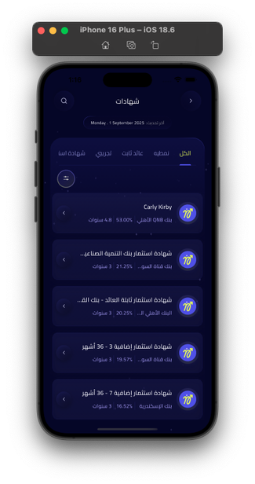</td>
  </tr>
  <tr>
    <td>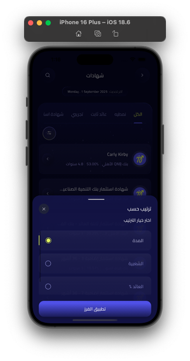</td>
    <td>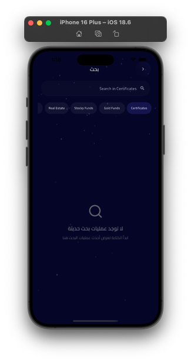</td>
    <td>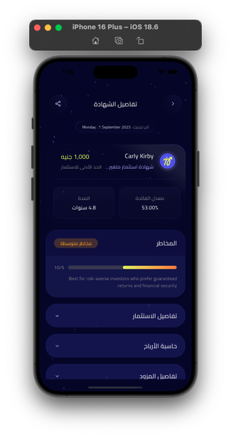</td>
    <td>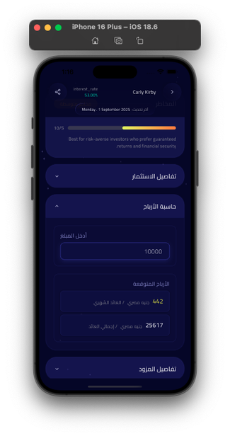</td>
  </tr>
  <tr>
    <td>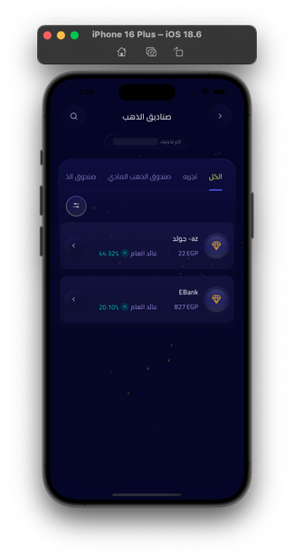</td>
    <td>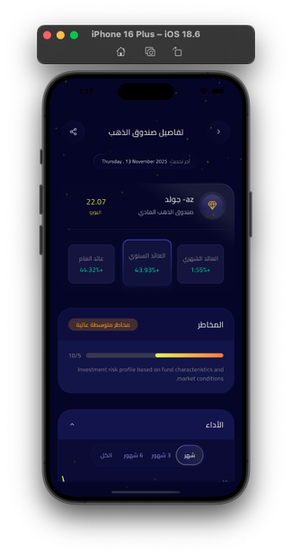</td>
    <td>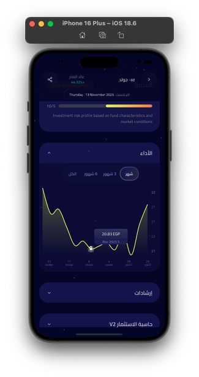</td>
    <td>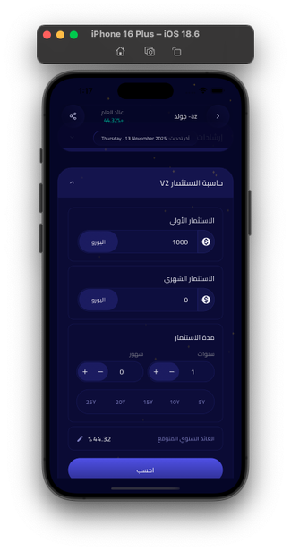</td>
  </tr>
  <tr>
    <td>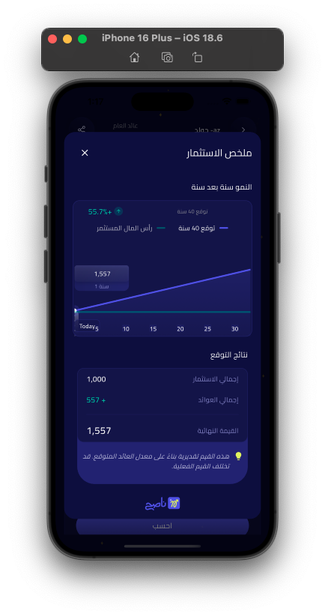</td>
    <td>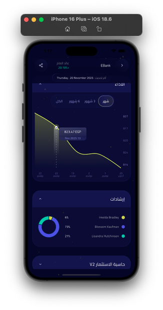</td>
    <td>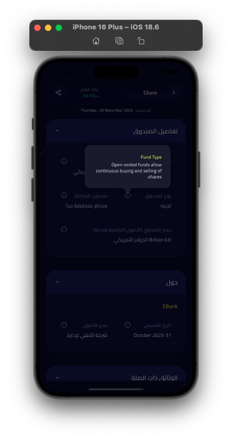</td>
    <td>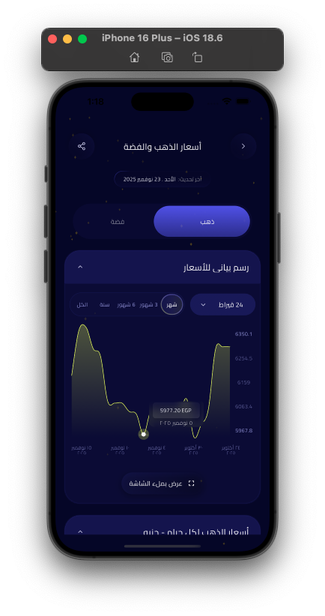</td>
  </tr>
  <tr>
    <td>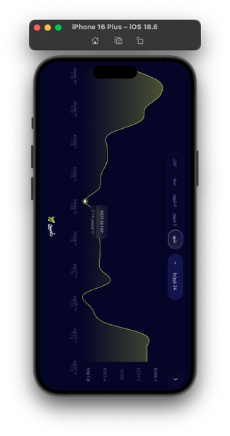</td>
    <td>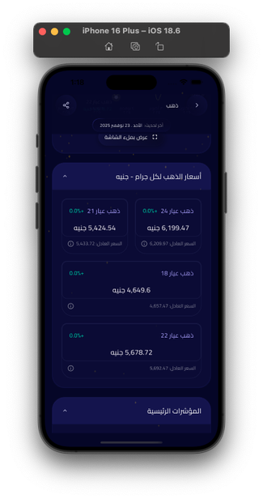</td>
    <td>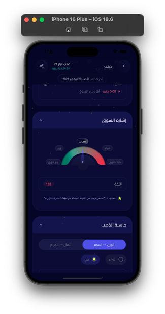</td>
    <td>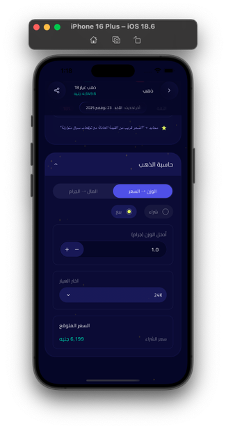</td>
  </tr>
  <tr>
    <td>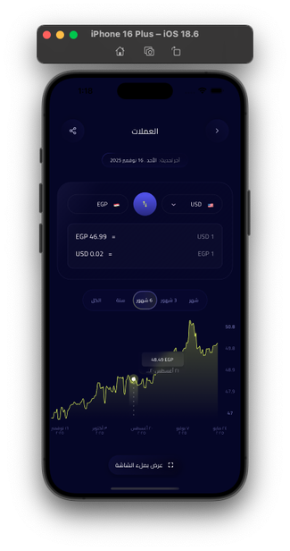</td>
    <td>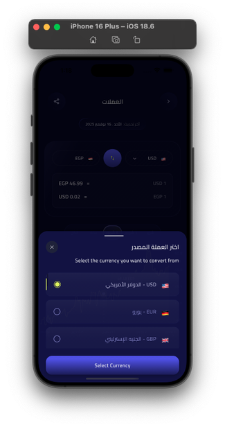</td>
    <td>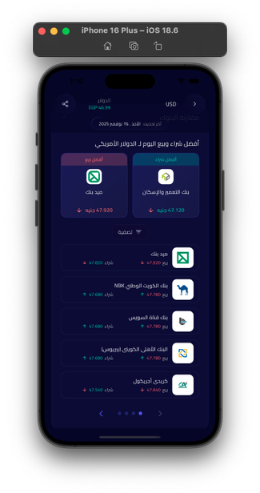</td>
    <td>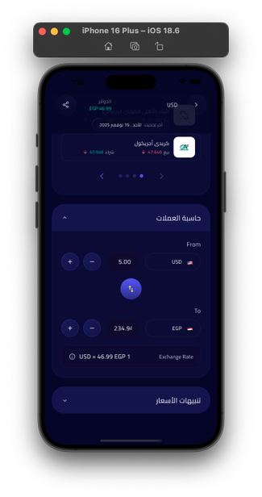</td>
  </tr>
</table>

## Demos (GIF Previews)

> ⏳ **Heads up:** GIFs may take a moment to load. If playback is slow, open them directly from the repo under `assets/demos/gifs/`.

<p align="center">
  <a href="https://drive.google.com/file/d/1UjMTOFUn8cb0AVGkVwpmst4aUFwvuJuM/view?usp=share_link" target="_blank" style="display: inline-block; margin: 16px;">
    
  </a>
</p>

### Authentication Flow
<p align="center">
  <a href="assets/demos/gifs/auth.gif" target="_blank">
    
  </a>
</p>

### Metals Module
<p align="center">
  <a href="assets/demos/gifs/metals.gif" target="_blank">
    
  </a>
</p>

### Currencies Module
<p align="center">
  <a href="assets/demos/gifs/currencies.gif" target="_blank">
    
  </a>
</p>

### Investment Funds
<p align="center">
  <a href="assets/demos/gifs/funds.gif" target="_blank">
    
  </a>
</p>

### Certificates & Language Switching
<p align="center">
  <a href="assets/demos/gifs/certificates-and-lang.gif" target="_blank">
    
  </a>
</p>

## Contact

- Email: <a href="mailto:eng.ashrf100@gmail.com?subject=Naseh%20Inquiry">eng.ashrf100@gmail.com</a>
- WhatsApp: <a href="https://wa.me/201287200535" target="_blank">+20 128 720 0535</a>
- Phone: <a href="tel:+201287200535">+20 128 720 0535</a>

---

**Project Statistics:**
- **50,000+ lines of code** across 450+ Dart files
- **30+ unique screens** with 200+ reusable widgets
- **50+ API endpoints** integrated
- **9 major feature modules** with complete separation of concerns
- **Performance**: <2s cold start, 60 FPS, <150MB memory, <100ms chart render for 1000+ points

