<div align="center">

  

  <h1>Nawah Healthcare</h1>

  <p>
    A modern Flutter healthcare platform for consultations, branch discovery, and service booking across MENA.
  </p>

  <div align="center">
    <label for="status-slider"><strong>Status:</strong> 75% complete</label><br/>
    <input id="status-slider" type="range" min="0" max="100" value="75" disabled style="width:260px;">
    <p>QA team validating finished features · Dev team finalizing social login, multi-payment booking, Google Maps branches</p>
  </div>

  <p>
    
    
    
    
    
  </p>

  <p>
    <a href="https://drive.google.com/file/d/1Kdtn28umpEsDeh-1nc50BrNpOLBvRk8u/view?usp=sharing">
      
    </a>
  </p>

</div>

## Overview

Nawah is the official mobile companion for a multi-branch medical center network operating across Egyptian governorates with new franchises launching in Qatar and Saudi Arabia. Patients discover clinics, book services, follow up on consultations, and receive proactive care journeys inside one bilingual (Arabic/English) experience that mirrors the organization’s custom Figma design system.

- Target markets: 🇪🇬 Egypt · 🇶🇦 Qatar · 🇸🇦 Saudi Arabia
- Deployment: Android first, iOS build on the same Flutter codebase
- Coverage: Consultations, services, branch locator with Google Maps, history, profile, notifications, settings
- Team: Product manager, UI/UX designer, PHP/Laravel backend team, Flutter engineer (me)

<p><strong>نظرة عامة مبسطة:</strong> التطبيق يخدم مراكز طبية متعددة الفروع داخل مصر مع توسع للدوحة والرياض. المستخدم يقدر يحجز خدمات، يتابع الاستشارات، ويستقبل إشعارات بالعربي أو الإنجليزي عبر تصميم مطابق للواجهات المعتمدة.</p>

## Status & Roadmap

  - ✅ Core flows: authentication, consultations, services, branches, notifications, localization
- ✅ Internal QA + beta testing (75% of backlog closed)
- 🚧 In progress: Booking & payments (multiple PSP environments), social auth, analytics events
- 🔜 Next: Rich booking summary, Apple Sign-In, provider-side messaging, App Store submission

<p><strong>الحالة الحالية :</strong> انتهينا من أغلب المزايا (تسجيل الدخول، الخدمات، الفروع). فريق الـQA يختبر، وفريق التطوير يضيف الدفع المتعدد وخريطة الفروع والـSocial Login. بعد ذلك هنجهز لإطلاق المتاجر.</p>

## Visual Storyboard

<table>
  <tr>
    <td>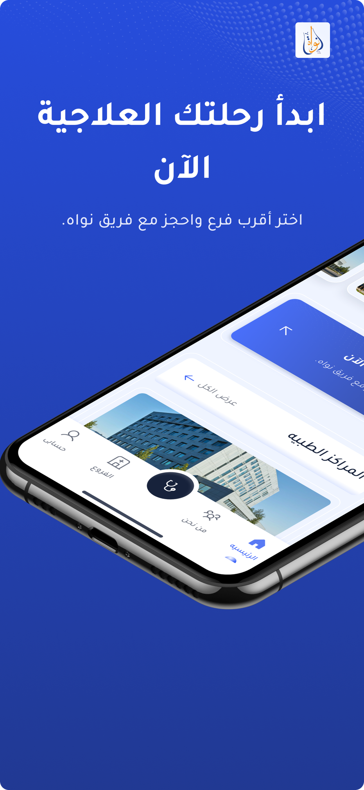</td>
    <td>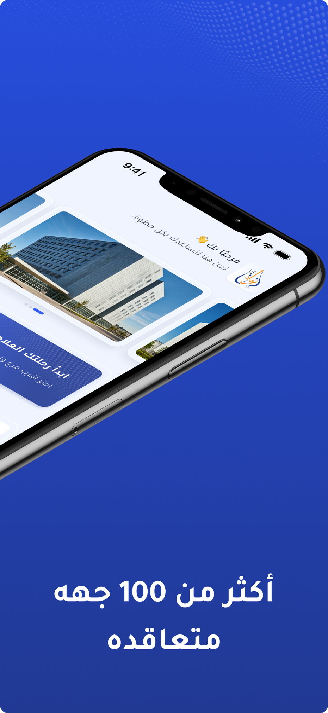</td>
    <td>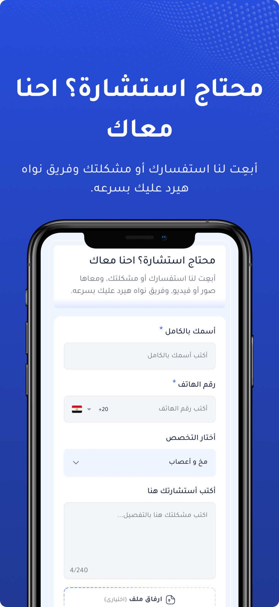</td>
    <td>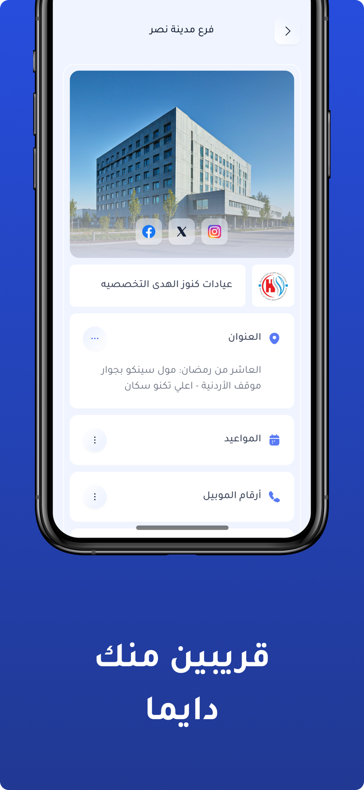</td>
    <td>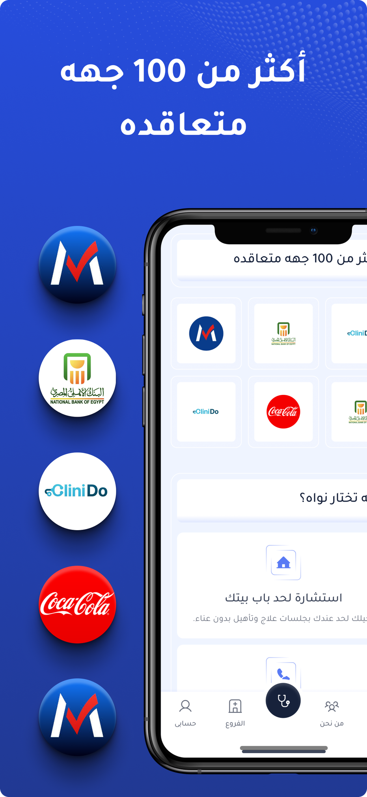</td>
  </tr>
</table>

## Technologies

| Layer | Stack |
|---|---|
| Language | Flutter, Dart |
| State | BLoC (flutter_bloc), Cubits, rxdart |
| Architecture | Clean Architecture (presentation + data only — domain layer skipped to reduce boilerplate) |
| Networking | dio + retrofit + interceptors, connectivity_plus |
| Backend | REST APIs powered by Laravel/PHP |
| Serialization | freezed, json_serializable, build_runner |
| Storage & Security | flutter_secure_storage, shared_preferences |
| UI/UX | Material 3 theming, custom Figma design system, dark & light themes, flutter_screenutil |
| Animations | Hero transitions, custom loaders, micro-interactions highlighting Flutter’s rendering power |
| Notifications | Firebase Cloud Messaging, flutter_local_notifications, timezone |
| Localization | easy_localization (AR/EN, RTL) |
| Analytics & Observability | Firebase Analytics events, Sentry, pretty_dio_logger |
| Dependency Injection | get_it / injectable-style service locator |

## Screens & Features

- **Splash & Onboarding**: Branded splash, user walkthrough, environment probing, quick-start carousel
- **Language & Theme Picker**: Dual-language (AR/EN) selector plus live dark/light toggle synced with Figma design tokens
- **Auth**: OTP login/signup, password reset, biometric unlock, social login landing this sprint
- **Consultations**: Attach notes/photos, follow statuses, receive responses, history export
- **Services Catalog**: Filtered services with pricing, duration, prerequisites, booking hooks
- **Branch Finder**: Live availability with Google Maps, working hours, directions, campaigns
- **Booking (WIP)**: Pay-now/pay-later, multi-payment environments, promo codes, receipts
- **Notifications**: Deep-linked push topics for offers, consultation updates, system alerts
- **Profile & Settings**: Preferences, security controls, language/theme switch, privacy/legal
- **System Reliability**: Offline awareness, retry logic, structured error surfaces, Sentry logging

## Highlights

- **Production architecture**: Feature-first Clean Architecture, GetIt DI, Retrofit APIs, seamless hand-off with Laravel backend.
- **Secure sessions**: Token refresh, biometric unlock, secure storage, offline awareness, Sentry logging for QA.
- **Custom Figma fidelity**: Dark/light themes, hero animations, shimmer/skeleton states, smooth transitions built with Flutter.
- **Localization excellence**: Arabic-first typography, mirroring, localized notifications, instant AR/EN toggle.
- **Deployment ready**: Remote config toggles, analytics hooks, QA regression scripts, multi-environment payment rollout plan.

## Visual Architecture

```
App (Flutter) — Clean Architecture (presentation · data)
├─ presentation/
│   ├─ cubits/blocs       # state holders per feature
│   ├─ pages/widgets      # screens, components, theming hooks
│   └─ routing            # shell navigation, deep links
└─ data/
    ├─ repositories       # implementations for services/consultations/branches
    ├─ network            # dio factory, interceptors, retrofit clients
    └─ local              # secure storage, preferences, cached payloads

Cross-cutting: localization, analytics/Sentry, notifications, payment adapters, error handling
```

## Project Structure (planned)

```
lib/
├─ core/
│  ├─ di/                   # dependency injection (GetIt registrations)
│  ├─ network/              # dio factory, interceptors, retrofit services
│  ├─ localization/         # easy_localization config, translation keys
│  ├─ services/             # firebase, notifications, secure storage
│  ├─ theme/                # colors, typography, Material 3 themes
│  ├─ utils/                # formatters, validators, helpers
│  └─ widgets/              # reusable UI components
├─ features/
│  ├─ auth/                 # login, signup, OTP, biometric, social
│  ├─ onboarding/           # first-run flow
│  ├─ consultations/        # submit, track, history
│  ├─ services/             # catalog, filters, booking hooks
│  ├─ branches/             # branch info, maps, availability
│  ├─ notifications/        # push center & topics
│  ├─ profile/              # user profile, settings, preferences
│  └─ main/                 # navigation shell, tabs
├─ data/                    # static configs, mock payloads
├─ injection_container.dart # GetIt bootstrapping
└─ main.dart                # entry point
```

## Screenshots

<table>
  <tr>
    <td>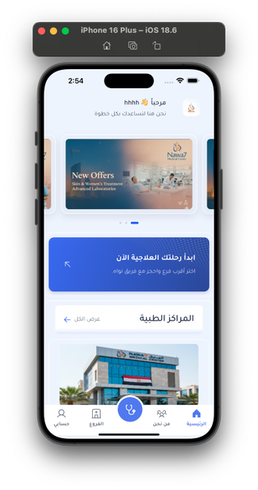</td>
    <td>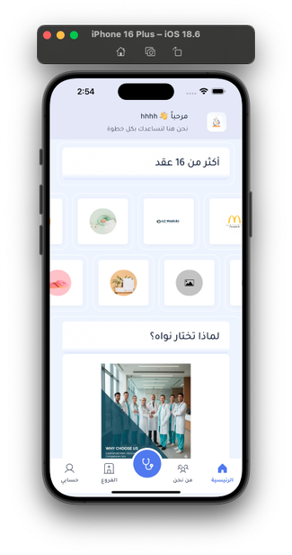</td>
    <td>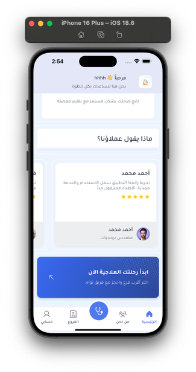</td>
    <td>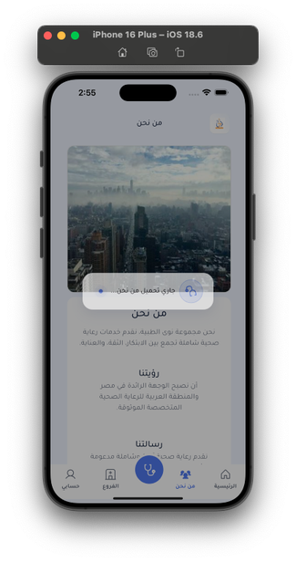</td>
  </tr>
  <tr>
    <td>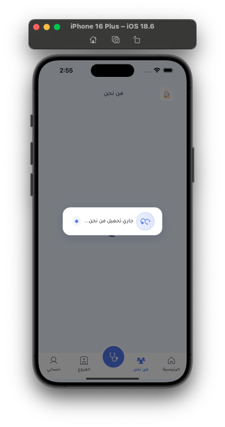</td>
    <td>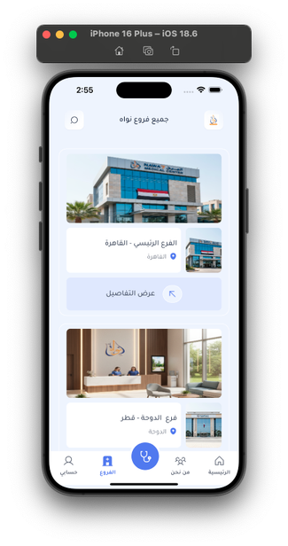</td>
    <td>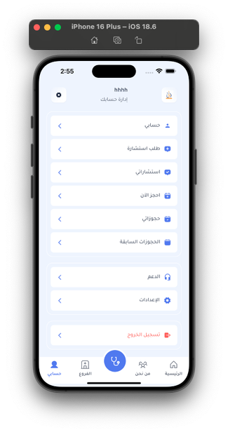</td>
    <td>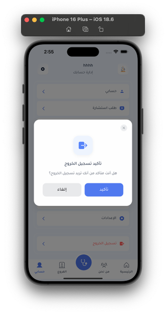</td>
  </tr>
  <tr>
    <td>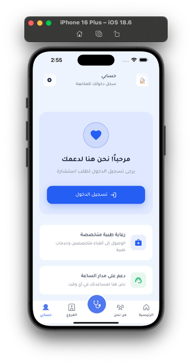</td>
    <td>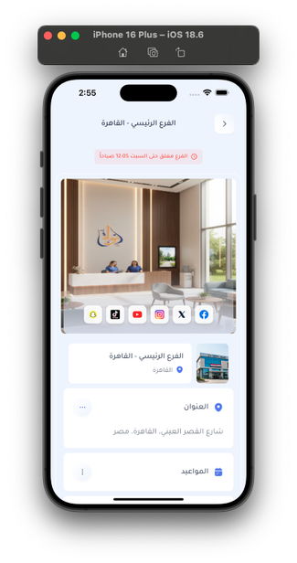</td>
    <td>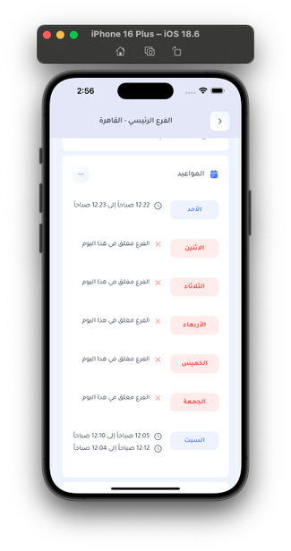</td>
    <td>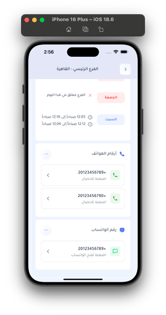</td>
  </tr>
  <tr>
    <td>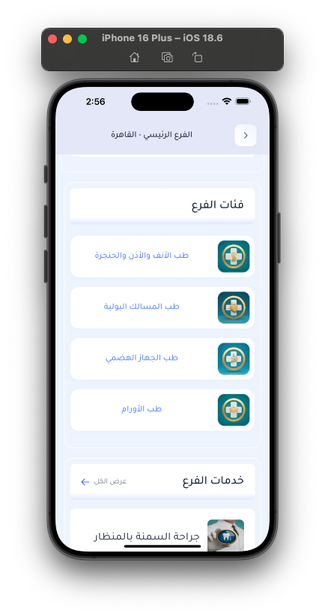</td>
    <td>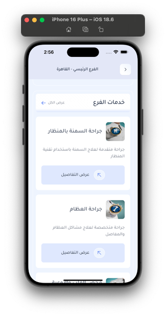</td>
    <td></td>
    <td>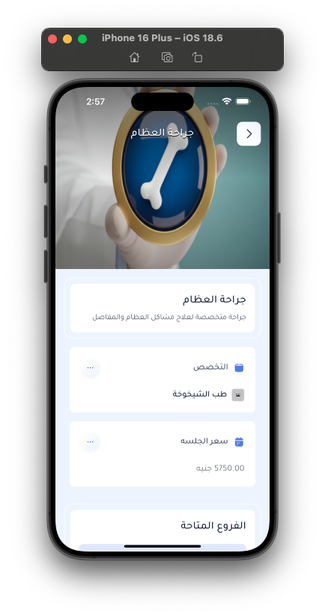</td>
  </tr>
  <tr>
    <td>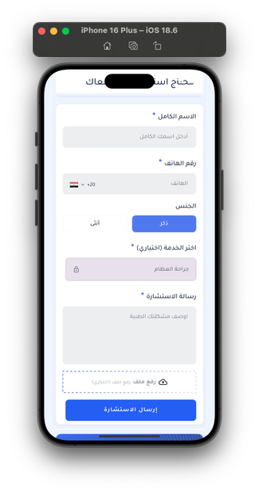</td>
    <td>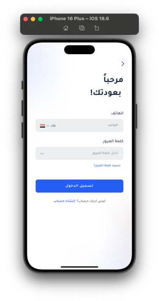</td>
    <td>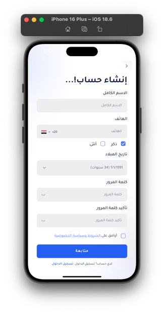</td>
    <td>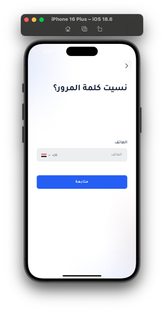</td>
  </tr>
</table>

## Demos (GIF Previews)

> ⏳ **Heads up:** GIFs may take a moment to load. If playback is slow, open them directly from the repo under `assets/demos/gifs/`.
>

<p align="center">
  <a href="https://drive.google.com/file/d/1Kdtn28umpEsDeh-1nc50BrNpOLBvRk8u/view?usp=sharing" target="_blank">
    
  </a>
</p>

<table>
  <tr>
    <td>
      <div style="width:320px;height:200px;border:1px solid #e2e8f0;border-radius:12px;background:#f8fafc;display:flex;align-items:center;justify-content:center;">
        <a href="assets/demos/gifs/onboarding.gif" target="_blank" style="text-decoration:none;text-align:center;color:#0f172a;">
          <div style="font-size:42px;">▶</div>
          <div><strong>Onboarding GIF</strong></div>
          <div style="font-size:12px;color:#475569;">Tap to open full animation</div>
        </a>
      </div>
    </td>
    <td>
      <div style="width:320px;height:200px;border:1px solid #e2e8f0;border-radius:12px;background:#f8fafc;display:flex;align-items:center;justify-content:center;">
        <a href="assets/demos/gifs/main-screens.gif" target="_blank" style="text-decoration:none;text-align:center;color:#0f172a;">
          <div style="font-size:42px;">▶</div>
          <div><strong>Main Navigation</strong></div>
          <div style="font-size:12px;color:#475569;">Tap to open full animation</div>
        </a>
      </div>
    </td>
  </tr>
  <tr>
    <td>
      <div style="width:320px;height:200px;border:1px solid #e2e8f0;border-radius:12px;background:#f8fafc;display:flex;align-items:center;justify-content:center;">
        <a href="assets/demos/gifs/consultant.gif" target="_blank" style="text-decoration:none;text-align:center;color:#0f172a;">
          <div style="font-size:42px;">▶</div>
          <div><strong>Consultations & Services</strong></div>
          <div style="font-size:12px;color:#475569;">Tap to open full animation</div>
        </a>
      </div>
    </td>
    <td>
      <div style="width:320px;height:200px;border:1px solid #e2e8f0;border-radius:12px;background:#f8fafc;display:flex;align-items:center;justify-content:center;">
        <a href="assets/demos/gifs/branches-and-branch.gif" target="_blank" style="text-decoration:none;text-align:center;color:#0f172a;">
          <div style="font-size:42px;">▶</div>
          <div><strong>Branches & Services</strong></div>
          <div style="font-size:12px;color:#475569;">Tap to open full animation</div>
        </a>
      </div>
    </td>
  </tr>
  <tr>
    <td>
      <div style="width:320px;height:200px;border:1px solid #e2e8f0;border-radius:12px;background:#f8fafc;display:flex;align-items:center;justify-content:center;">
        <a href="assets/demos/gifs/auth.gif" target="_blank" style="text-decoration:none;text-align:center;color:#0f172a;">
          <div style="font-size:42px;">▶</div>
          <div><strong>Auth Flow</strong></div>
          <div style="font-size:12px;color:#475569;">Tap to open full animation</div>
        </a>
      </div>
    </td>
    <td>
      <div style="width:320px;height:200px;border:1px solid #e2e8f0;border-radius:12px;background:#f8fafc;display:flex;align-items:center;justify-content:center;">
        <a href="assets/demos/gifs/settings.gif" target="_blank" style="text-decoration:none;text-align:center;color:#0f172a;">
          <div style="font-size:42px;">▶</div>
          <div><strong>Settings & Localization</strong></div>
          <div style="font-size:12px;color:#475569;">Tap to open full animation</div>
        </a>
      </div>
    </td>
  </tr>
  <tr>
    <td>
      <div style="width:320px;height:200px;border:1px solid #e2e8f0;border-radius:12px;background:#f8fafc;display:flex;align-items:center;justify-content:center;">
        <a href="assets/demos/gifs/services.gif" target="_blank" style="text-decoration:none;text-align:center;color:#0f172a;">
          <div style="font-size:42px;">▶</div>
          <div><strong>Services Carousel</strong></div>
          <div style="font-size:12px;color:#475569;">Tap to open full animation</div>
        </a>
      </div>
    </td>
    <td></td>
  </tr>
</table>

## Contact

- Email: <a href="mailto:eng.ashrf100@gmail.com?subject=Nawah%20Inquiry">eng.ashrf100@gmail.com</a>
- WhatsApp: <a href="https://wa.me/201287200535" target="_blank">+20 128 720 0535</a>
- Phone: <a href="tel:+201287200535">+20 128 720 0535</a>

