<div align="center">

  

  <h1>Syaratc Online</h1>

  <p>
    Find, finance, and manage cars with a modern, high‑performance Flutter app powered by clean architecture.
  </p>

  <p>
    <strong>Market:</strong> Saudi Arabia 🇸🇦 — Arabic & English experience
  </p>

  <p>
    <a href="https://syaratc.online/en"></a>
    <a href="https://play.google.com/store/apps/details?id=com.syatric.app"></a>
    <a href="https://drive.google.com/file/d/1nF3FgbEGtSoubXAKsBPIOG4G5JTtZlUg/view?usp=sharing"></a>
  </p>

</div>

## Overview

Syaratc Online is a service that helps users find cars and secure financing — a car marketplace and financing companion. The app connects users with curated car offers, financing partners, and company programs while delivering a smooth, localized experience for both end‑users and companies. It mirrors the core capabilities available on the website (`https://syaratc.online/en`) and adds mobile‑first features like push notifications, offline‑first storage, and background token refresh.

This repository hosts the app profile and demos only (no source code). The product targets users in <strong>Saudi Arabia 🇸🇦</strong> with Arabic as a first‑class locale and English as a secondary locale.

<p>
  <strong>نظرة عامة (Arabic):</strong>
  «سيراتك أونلاين» خدمة تساعد المستخدمين على الحصول على السيارة وتمويلها بسهولة — منصة لعرض السيارات وربطك بشركاء التمويل وإدارة طلباتك بسلاسة. التجربة مصممة لسوق المملكة العربية السعودية 🇸🇦 مع دعم كامل للغتين العربية والإنجليزية، إضافة إلى الإشعارات الفورية، الحفظ دون اتصال، وتحديث آمن للرموز في الخلفية.
</p>

## Technologies

| Layer | Technology |
|---|---|
| Language | Flutter, Dart |
| State | BLoC (Cubit), rxdart |
| Storage | Hive for local persistence |
| Architecture | Clean Architecture (presentation + data, no separate domain layer) |
| Networking | dio + retrofit; API handler with interceptors, pagination, error mapping |
| Serialization | json_serializable, freezed |
| FP Utilities | dartz |
| UI/UX | Slivers for performant lists, skeleton loading, onboarding game/flow, flutter_screenutil |
| i18n | Double localization (Arabic and English) |
| Notifications | Firebase Cloud Messaging + local notifications (new offers, order updates, company campaigns) |
| Analytics | Firebase Analytics (events for conversion, OTP success, engagement) |
| Dependency Injection | get_it / injectable |
| Web Content | In‑app WebView for Terms and Conditions, Privacy |

## Screens & Features

- **Splash**: fast app startup and restoring user session
- **Auth**: login and signup, OTP verification, resend/refresh OTP
- **Forgot Password**: password reset with secure flows
- **Background Token Refresh**: silent refresh for both guest and authenticated sessions
- **Onboarding Car Game**: interactive onboarding car game that engages users and increases activation
- **Home**: brand search, featured products, performant sliver lists, skeleton loading
- **Offers**: special/featured offers, filters, pagination
- **Order/Form**: guided purchase order form with validation and autosave
- **Companies Offers**: tailored programs for businesses
- **User Profile**: profile view/edit, saved cars, preferences
- **Drawer**: links to Terms & Conditions and Privacy via WebView

## Screenshots

<table>
  <tr>
    <td>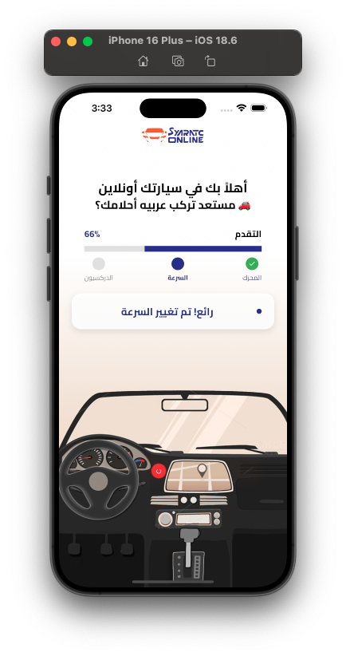</td>
    <td>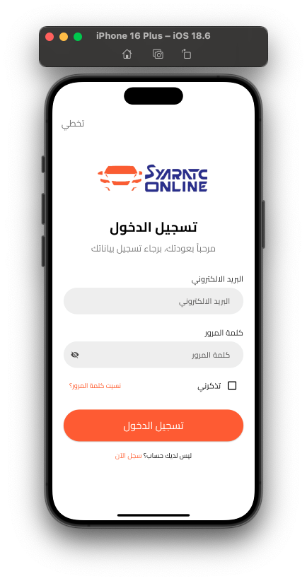</td>
    <td>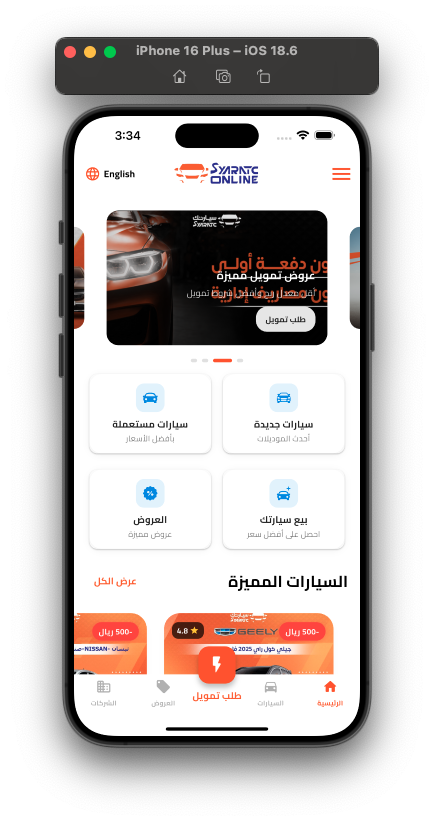</td>
  </tr>
  <tr>
    <td>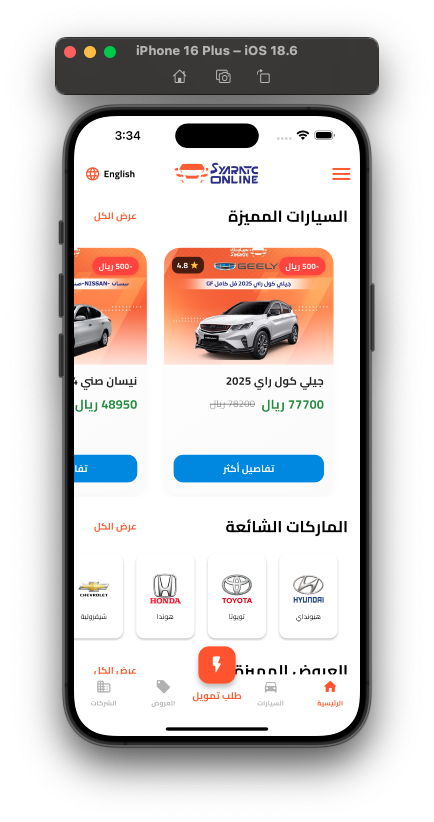</td>
    <td>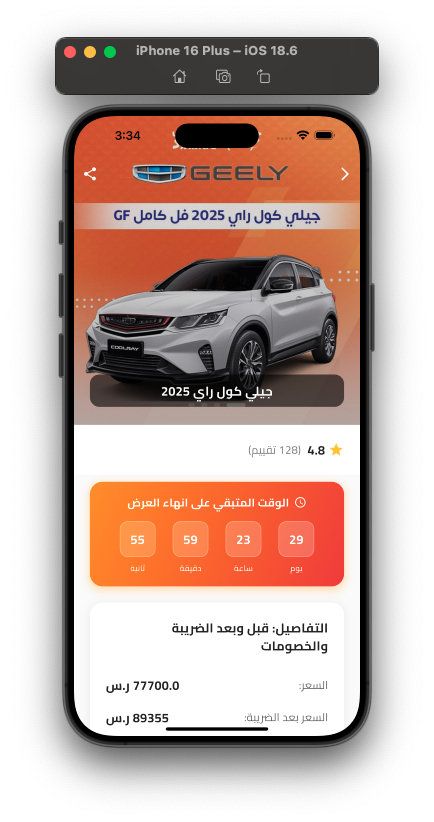</td>
    <td>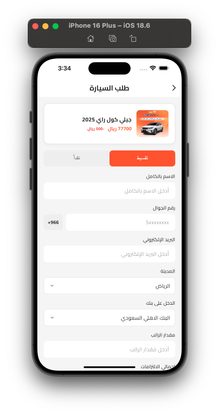</td>
  </tr>
  <tr>
    <td>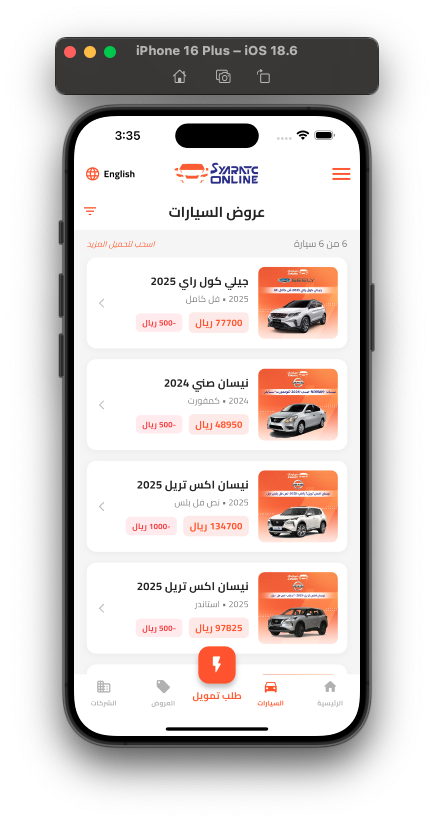</td>
    <td>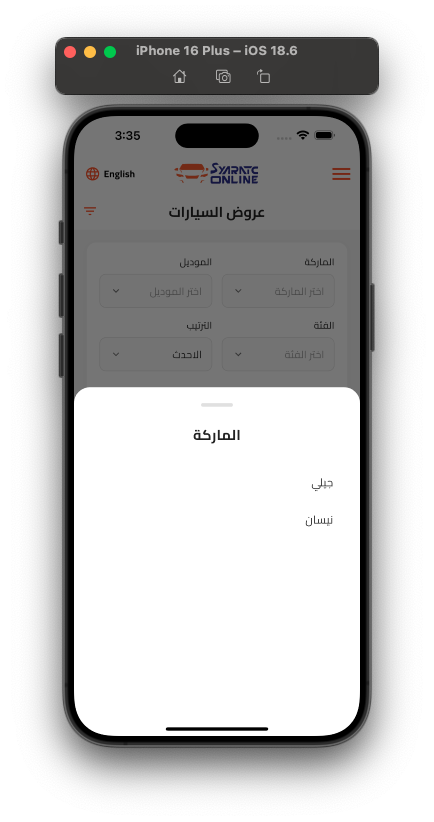</td>
    <td>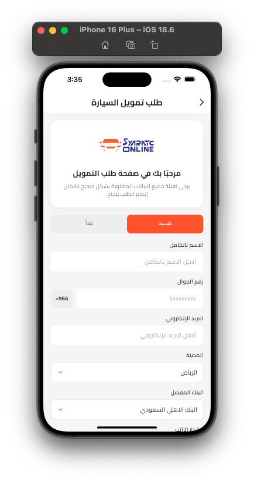</td>
  </tr>
  <tr>
    <td>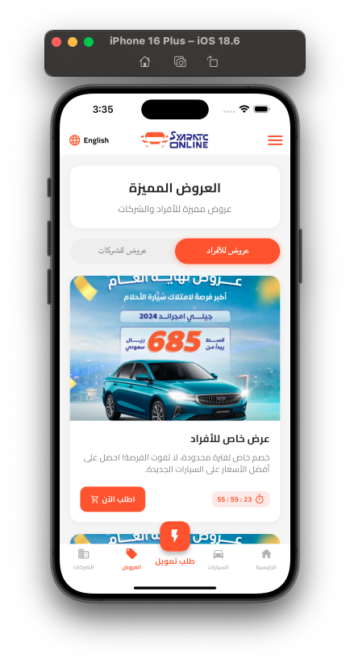</td>
    <td>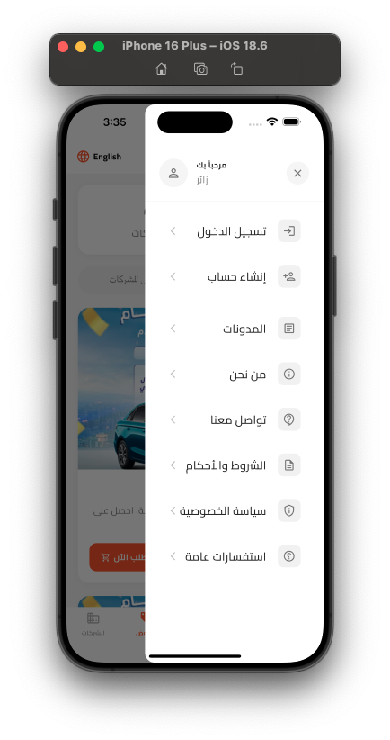</td>
    <td></td>
  </tr>
</table>

## Visual Architecture

```
App (Flutter) — Clean Architecture (without separate domain layer to reduce boilerplate)
├─ presentation/        # Widgets, pages, BLoC cubits, UI state, use‑cases live here
└─ data/                # DTOs, mappers, Hive boxes, API clients/interceptors, repositories

Cross‑cutting: localization, error handling, analytics, notifications
```

## Project Structure (planned)

```
lib/
├─ core/                      # app-wide building blocks
│  ├─ di/                     # dependency injection (get_it/injectable)
│  ├─ network/                # api client, interceptors, error mapping
│  ├─ localization/           # i18n setup (ar, en)
│  ├─ notifications/          # FCM + local notifications
│  ├─ utils/                  # formatters, validators, shared helpers
│  └─ widgets/                # reusable UI components
└─ features/                  # vertical slices by business area
   ├─ auth/                   # login, signup, otp, refresh
   ├─ onboarding/             # onboarding game/flow
   ├─ home/                   # brands, featured, skeletons
   ├─ offers/                 # lists, filters, pagination
   ├─ order/                  # order form, steps, validation
   ├─ companies/              # company programs
   ├─ profile/                # user profile
   └─ legal/                  # terms & privacy (WebView)
```

## Demos (GIF Previews)

> Lightweight GIFs play inline on GitHub; click any image for full size.
> Hint: GIF previews may take a second to load — please wait for the loading indicator. If playback is choppy, watch the full demo video here: [Full demo video](https://drive.google.com/file/d/1nF3FgbEGtSoubXAKsBPIOG4G5JTtZlUg/view?usp=sharing).

### Onboarding Game (first‑run experience)
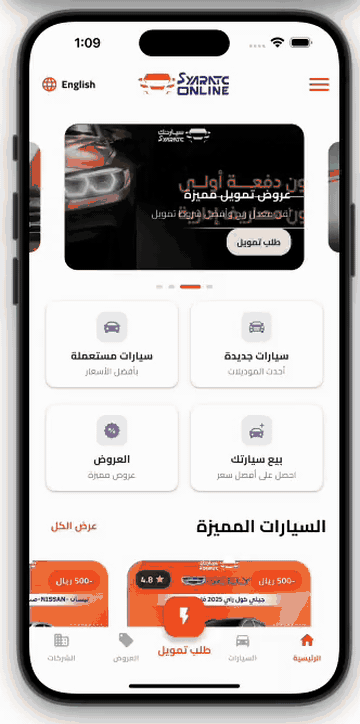

### Home


### Offers


### Form & Drawer
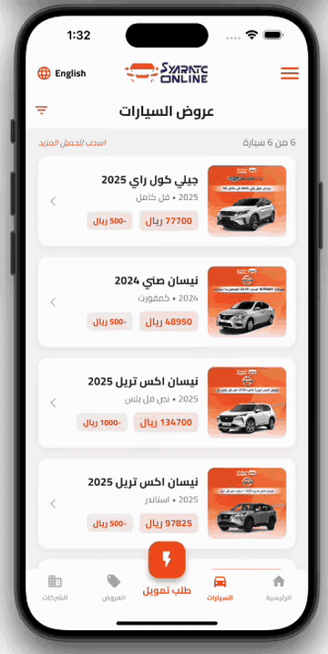

Full video is also available on Google Drive:

- [Watch full demo](https://drive.google.com/file/d/1nF3FgbEGtSoubXAKsBPIOG4G5JTtZlUg/view?usp=sharing)

## Contact

- Email: <a href="mailto:eng.ashrf100@gmail.com?subject=Syaratc%20Online%20Inquiry">eng.ashrf100@gmail.com</a>
- WhatsApp: <a href="https://wa.me/201287200535" target="_blank">Chat on WhatsApp</a>
- Phone: <a href="tel:+201287200535">+20 128 720 0535</a>

<!-- Suggestions and questions intentionally kept out of README for brevity and professionalism. -->


